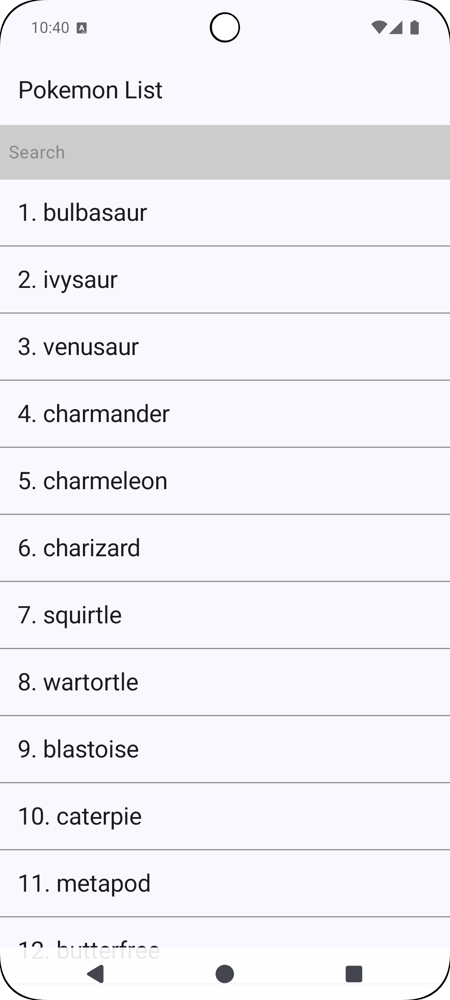
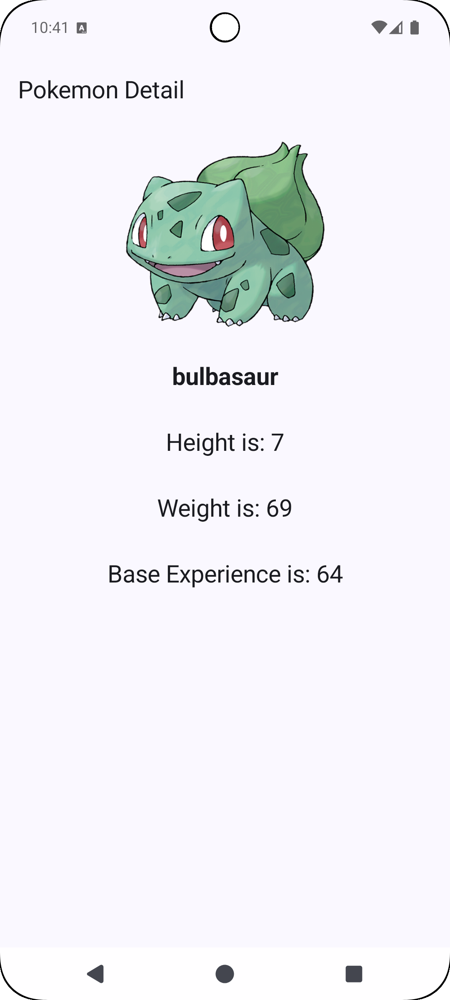
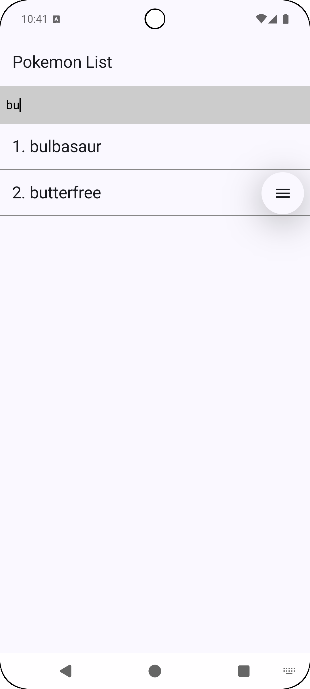

# Pokemon Explorer App

A modular Android app built with **Kotlin**, **Jetpack Compose**, and **MVVM Clean Architecture** to explore a list of Pokemon from the [PokeAPI](https://pokeapi.co/).

---

## 🚀 Features

- 📝 Pokemon list using LazyColumn
- 📦 Clean modular structure (app, domain, data, network, di)
- 🧪 ViewModel & UseCase unit testing
- 🌐 Retrofit with safe API handling
- 🧩 Dependency Injection with Hilt
- ⚡  Coroutines + Flows for async/reactive programming
- 🧪 End to End Jetpack Compose Instrumental testing

---

## 🧱 Architecture

The project uses a **multi-module Clean Architecture** setup

* app - Entry point, UI (Compose), ViewModels, Navigation
  * presentation (UI with Jetpack Compose)
  * ViewModels (Hilt-injected ViewModels)
  * MainNavigation.kt
  * Unit tests
  * Instrumental test

* domain - UseCase interfaces and data models (pure Kotlin)
  * UseCases
  * Contracts (interfaces)
  * Models

* data - Implements domain using repository pattern
  * Repositories (implements domain layer)
  * Remote Data Source (interface)
  * Unit tests

* network - Retrofit interfaces, API responses
  * Remote Data Sources (implementation)
  * Retrofit API services
  * DTO to domain transformers
  * Unit tests

* di - Hilt modules for dependency injection
  * Hilt Modules (provides ViewModels, UseCases, Retrofit, etc.)

Each layer is separated as an independent Gradle module:
- `:app`
- `:domain`
- `:data`
- `:network`
- `:di`

📦 Tech Stack

| Layer        |                Technology                |
|--------------|:----------------------------------------:|
| UI           |       Jetpack Compose, Material 3        |
| State        |           ViewModel, StateFlow           |
| DI           |                   Hilt                   |
| Networking   |             Retrofit, OkHttp             |
| Reactive     |         Kotlin Coroutines, Flow          |
| Architecture | MVVM Clean Architecture + Modularization |
| Testing      |      JUnit, MockK, Compose Ui Test       |

## 📸 Screenshots

| Screen | Preview                                                          | 
|--------|------------------------------------------------------------------| 
| List   |    |
| Detail |  |
| Search |  |

## 🛠 Getting Started

### Prerequisites

- Android Studio Meerkat or newer
- JDK 18+
- Gradle 8.13
- AGP 8.11.1

## 📌 Limitation 

🔄 Pagination is **not implemented** on scroll. 

Currently, the app fetches and displays only the initial page (first 20 Pokemon) from the API.
The code is structured in a way that makes it easy to extend this later with lazy loading or adding scroll listener to fetch next set of pokemon.